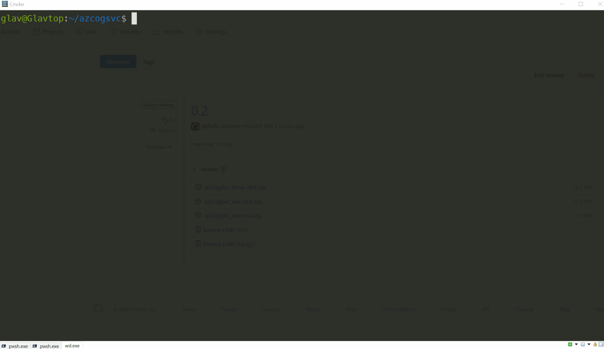
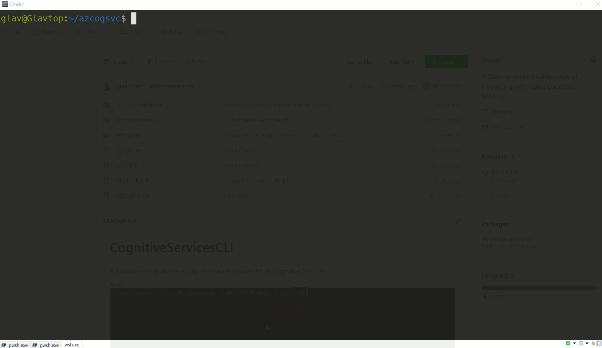

# CognitiveServicesCLI
A Command line interface way of interacting with Azure Cognitive Services.
Note that it is very early days for this project which currently only supports TextAnalytics. Available in Windows, Linux and MacOs builds.


## Examples
##### Simple use of TextAnalytics Sentiment analysis to output results in JSON format.


##### Use of TextAnalytics Sentiment analysis and Keyphrase analysis to output results in TABLE format.


## Usage
```
dotnet run -- --location WestUS -k {api-key} -ta -sa -txt "Sunday has been a lovely day of relaxation. I managed to plant some vegetables and herbs before the rain" -ka
```

The above syntax is:
* --location = location of the Azure Cognitive service (can be --location or -l)
* -k = API Key of the Azure service (can be --key or -k)
* -ta = Use text analytics series of options (currently only one supported with -cv Computer vision coming next)
* -sa = Peform sentiment analysis
* -txt = The text to analyse
* -ka = Perform keyphrase analysis
* -ld = Perform language detection

This yields the following results (note: this is only preliminary form, and will typically outout in Json, table or CSV like the Azure CLI)

```
>> Sentiment Analysis <<
DocumentSetId
-------------
0
        Id      Score                   Sentiment
        --      -----                   ---------

        1       0.9565765857696530      Positive
        2       0.5000000000000000      Neutral
```

You can also specify a file to read intead of supplying the actual text.
 ```
dotnet run -- --location WestUS -k {api-key} -ta -sa -f "c:\temp\testfile.txt" -ka
``` 
